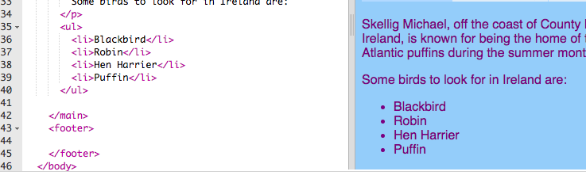

## Making a list

On this card you will learn how to turn a list of items, such as "unicorns, robots, cats" into a nicer looking list that you can do cool things with later.
  
- In the `index.html` file, add the following code just above the line with `</main>` on it:

```html
    <ul>
        <li>Blackbird</li>
        <li>Robin</li>
        <li>Hen Harrier</li>
        <li>Puffin</li>
    </ul>
```

The result should be a nice list like this: 



Notice that there is a separate pair of `<li> </li>` tags around each thing in the list. 

This is a list of some animals you might see in Ireland. You can change the items on the list to things that make sense for your website, and add a **paragraph** above the list to describe what it's a list of, if you like!

How about if you wanted a numbered list? It's almost the same, but instead of `ul`, you use `ol`. A numbered list is also called an **ordered** list. 

- Add the following code underneath the code you just wrote \(make sure it's **after** the `</ul>` tag!\):

```html
    <p>
        Some of the robin's favourite things to eat are:
    </p>
    <ol>
        <li>Beetles</li>
        <li>Worms</li>
        <li>Fruit</li>
    </ol>
```

Here's what it should look like now:


--- challenge ---

## Challenge: Add style to your lists

- See if you can add **CSS rules** to your stylesheet to change how your lists look.

--- /challenge ---
