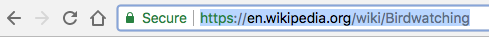
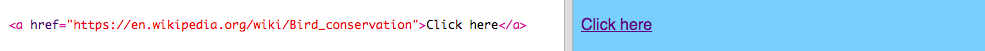
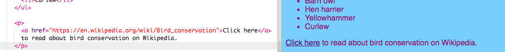

## Creating links

On this card you'll learn how to make a link that takes you to another page when it's clicked.

- Add the following code to the body section of `index.html`:

```html
  <a href="">Click here</a>
```

The `<a> </a>` tags turn whatever is in between them into a link. 
 
- Try clicking your link to see what happens. It does nothing, right?

That's because the `href` attribute is empty at the moment. It needs to contain the **URL** (web address) of the page that you want to link to.

- Go to Wikipedia and find a page about something on your website. I'm going to use the page about bird conservation.

- Click in the address bar and select all of the text in i5. That's the complete URL of the page you're on. Press the <kdb>Ctrl</kdb> (or <kdb>cmd</kdb>) and <kdb>C</kdb> keys at the same time to copy it. 

  

- In your trinket, click in between the quotation marks after `href=` and press the <kdb>Ctrl</kdb> (or <kdb>cmd</kdb>) and <kdb>V</kdb> keys at the same time to paste in the URL you just copied. Your code should look something like this now:

```html
  <a href="https://en.wikipedia.org/wiki/Bird_conservation">Click here</a>
```

You just created your first link! Click on it to see if it works now.



--- collapse ---
---
title: Links to other websites
---
Trinket has trouble with some web addresses. You can try URLs of websites other than Wikipedia if you like, but they may not work in your trinket. However, if you were to download your project and view the files in a web browser, you would see the links working.

--- /collapse ---

- Try putting a picture in between the `<a> </a>` tags instead of the words `Click here`, like this:

```html
  <a href="https://en.wikipedia.org/wiki/Bird_conservation">
      
  </a>
```

- Click on your picture. Do you see that it was turned into a link?

You can put a link into other elements of your webpage too, such as in a paragraph or even in a list. Here is an example of a sentence with a link in it:

```html
  <p>
    <a href="https://en.wikipedia.org/wiki/Bird_conservation">Click here</a> to read about bird conservation on Wikipedia.
  </p>
```



--- challenge ---

## Challenge: put a link into a list

- See if you can make a list that contains a link inside one of the list items.

--- hints ---

--- hint ---

To turn a list item `<li> </li>` into a link, put all of it, including the list tags, in between a pair of link tags `<a> </a>` and add the `href` attribute as you've done above.

--- /hint ---

--- hint ---

In the following list, the 'Hen harrier' list item has been turned into a link.

```html
    <ul>
        <li>Barn owl</li>
        <a href="https://en.wikipedia.org/wiki/Hen_harrier"><li>Hen harrier</li></a>
        <li>Yellowhammer</li>
        <li>Curlew</li>
    </ul>
```

--- /hint ---

--- /hints ---


--- /challenge ---


